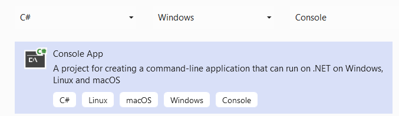

# SolarWinds.Tools.CommandLineTool
## Motivation
As author of numerous data-generators, I was tired of copy/pasting the same bits and pieces of code from project-to-project and wasting time to get a basic project up and running where I could focus on the task.

The CommandLineTool was designed as a base-class that includes the following tools for use in any command-line application with the focus on manipulation of Orion data:

- Command Line Options support via [CommandLineParser](https://github.com/commandlineparser/commandline/wiki)
- Predefined options interfaces for [Orion Login](https://github.com/rmatejka-sw/SolarWinds.Tools.Orion.AlertDataGenerator/blob/master/SolarWinds.Tools.CommandLineTool/Options/IOrionOptions.cs), [Orion Database Login](https://github.com/rmatejka-sw/SolarWinds.Tools.Orion.AlertDataGenerator/blob/master/SolarWinds.Tools.CommandLineTool/Options/IDatabaseOptions.cs), and [Time Range Options](https://github.com/rmatejka-sw/SolarWinds.Tools.Orion.AlertDataGenerator/blob/master/SolarWinds.Tools.CommandLineTool/Options/ITimeRangeOptions.cs)
- Simple SQL access using [Dapper.Extensions](https://dapper-tutorial.net/dapper)
- Orion Http Authentication to support WebApi access to any Orion instance
- Proxy classes for accessing the following Orion WebApis: 
  - [SwisApi2](https://github.com/rmatejka-sw/SolarWinds.Tools.Orion.AlertDataGenerator/blob/master/SolarWinds.Tools.CommandLineTool/Service/OrionSWISQueryClient/OrionSWISQueryClient.cs) - SWQL queries against Orion
  - [MapsEntities](https://github.com/rmatejka-sw/SolarWinds.Tools.Orion.AlertDataGenerator/blob/a00f43d5ebb64f6efa34b0e3b42cd9d97c96ff0d/SolarWinds.Tools.CommandLineTool/Service/MapsClient/MapsClient.cs#L3019) - Api for querying entity relations
  - [MapsGraphs](https://github.com/rmatejka-sw/SolarWinds.Tools.Orion.AlertDataGenerator/blob/a00f43d5ebb64f6efa34b0e3b42cd9d97c96ff0d/SolarWinds.Tools.CommandLineTool/Service/MapsClient/MapsClient.cs#L2371) - Api for querying map data for an entity
  - [PerfStackEntities](https://github.com/rmatejka-sw/SolarWinds.Tools.Orion.AlertDataGenerator/blob/afa1f5f82ce8fcdcdb5c526e96a82096ab229c59/SolarWinds.Tools.CommandLineTool/Service/PerfStackClient/PerfStackClient.cs#L20) - Api for querying entity metrics data
- [SwisEntity](https://github.com/rmatejka-sw/SolarWinds.Tools.Orion.AlertDataGenerator/blob/master/SolarWinds.Tools.CommandLineTool/SwisEntities/SwisEntity.cs) base class that simplies the use of SwisApi2 by mapping results to a generic class and adding wildcard support (where performance may not be an issue):
    ````
        // SELECT * FROM Orion.NetObjectTypes
        IList<NetObjectTypes> netObjectType = SwisEntity.Get<NetObjectTypes>() 
    ````
- [SqlEntites](https://github.com/rmatejka-sw/SolarWinds.Tools.Orion.AlertDataGenerator/blob/master/SolarWinds.Tools.CommandLineTool/SqlEntities/SqlEntityBase.cs) base class that simplifies the use of Dapper by adding caching and wildcard support (where performance may not be an issue):
    ````
        // SELECT * FROM AlertHistory
        IList<AlertHistory> alertHistory = SwisEntity.GetList<AlertHistory>() 
- [System_ManagedEntity](https://github.com/rmatejka-sw/SolarWinds.Tools.Orion.AlertDataGenerator/blob/master/SolarWinds.Tools.CommandLineTool/SwisEntities/System_ManagedEntity.cs) class for querying accessing commonly used ManagedEntities properties for any managed entity instances 

## Usage
One of the primary goals on the CommandLineTool was to minimize the time required in order to get up-and-running with your data generation task. To achieve this goal, there are only three steps required as outlined below.
### Step 1: Create Core Comman Line project
The first step is to create an ASP.NET Core Console App

### Step 2: Create Action Class
The next step is to define one or more classes that implement the ICommandLineAction and IDatabaseOptions interface. The function of the action class is two-fold. First, it provides a Run method that will perform the work associated with the action. 

Second, it defines properties for any settings that the user will be able to change via the command line arguments. Each property that you want to use as a command line argument should have an [Option](https://github.com/commandlineparser/commandline/wiki/Option-Attribute) attribute and the Action class should use the [Verb](https://github.com/commandlineparser/commandline/wiki/Verbs) attribute. See the AlertDataGenerator [GenerateAlertsAction](https://github.com/rmatejka-sw/SolarWinds.Tools.Orion.AlertDataGenerator/blob/master/SolarWinds.Tools.CommandLineTool.AlertDataGenerator/GenerateAlertsAction.cs) class for a complete example and [Defining Command Line Options](#defining-command-line-options) below. 
### Step 3: Create Application Class
The final step is to create your application class that inherits from CommandLineTool and implements a static main method that creates an instance of your class and calls the Run method. In addition to teh main method, you must define an Actions methos which returns a list of the actions you defined for yoru generator.
````
public class MyDataGenerator : CommandLineTool
    {

        private static int Main(string[] args)
        {
            return (int)new MyDataGenerator().Run(args);
        }

        public override IList<ICommandLineAction> Actions => new List<ICommandLineAction>
        {
            new MyAction()
        };
    }
````
### Defining Command Line Options
The [Command Line Parser Library](https://github.com/commandlineparser/commandline) is used for handling the parsing and generation of help page for the command line tool. These attributes will be used when you define an Action class that implements the [ICommandLineAction](https://github.com/rmatejka-sw/SolarWinds.Tools.Orion.AlertDataGenerator/blob/master/SolarWinds.Tools.CommandLineTool/ICommandLineAction.cs) interface.

#### Using Predefined Options Interfaces
Three predefined interfaces exists that define the options and associated command-line properties for Orion database access, SWIS access, and Time Range specification as defined below.

##### IDatabaseOptions
You Action class should implement IDatabaseOptions if you require access to an Orion Database. It provides the following options:
````
        [Option("server", Default = "localhost", HelpText = "Name of database server to which records will be added.")]
        string DbServerName { get; set; }

        [Option("db", Default = "SolarWindsOrion", HelpText = "Name of database to which records will be added.")]
        string DbName { get; set; }

        [Option('u', "username", Default = "SolarWindsOrionDatabaseUser ", HelpText = "Database user name")]
        string DbUserName { get; set; }

        [Option("pass", Default = "123", HelpText = "Database user password")]
        string DbPassword { get; set; }
````
When used in yoru application, access to the Ortion Database is done usng